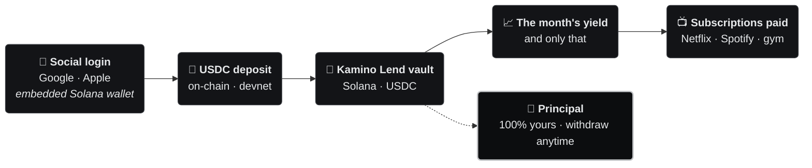
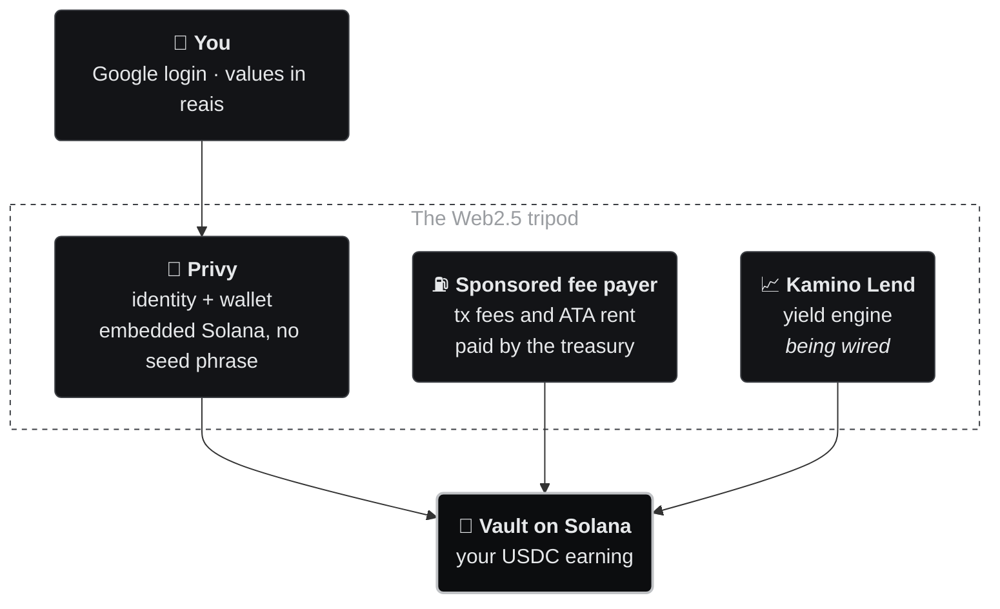
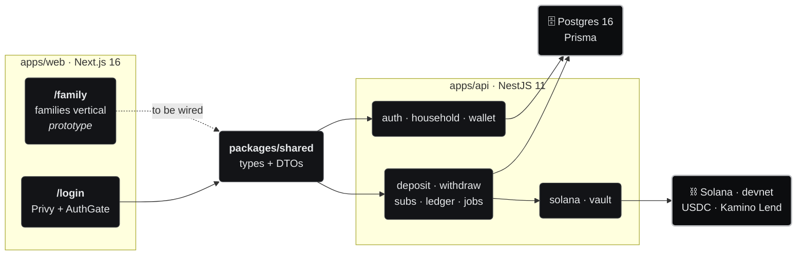

<div align="center">

# Yield2Pay · Solana

### The yield on your own money pays your subscriptions.<br/>And the money stays yours.

You deposit once. It earns yield in a DeFi vault on Solana.<br/>
**Only the yield** pays Netflix, Spotify, ChatGPT, the gym.<br/>
The principal stays **100% yours** — withdraw it whenever you want.

<br/>


-2ea44f?style=for-the-badge&labelColor=0c0d0f)

[🇧🇷 Português](README.md) · **🇺🇸 English**

<br/>

[**The idea**](#-the-idea-in-30-seconds) · [**Freedom percentage**](#-freedom-percentage) · [**How it works**](#-how-it-works) · [**The screens**](#-the-family-screens) · [**Architecture**](#-architecture) · [**Roadmap**](#-roadmap) · [**Run it**](#-run-it-locally)

</div>

> [!NOTE]
> **This repo is Yield2Pay on Solana.** A fork of the original base (Stellar/Soroban, with the B2B
> vertical and the Etherfuse ramp) migrated to **Solana** with a single product: the **families
> vertical**. The on-chain engine was rewritten — what was `stellar/` + fee-bump is now `solana/` +
> a sponsored fee payer; the DeFindex vault gives way to **Kamino Lend**; the PIX ramp left the MVP
> and went back to the [roadmap](#-roadmap). The original Stellar repo lives on as `FixEarn`.

---

## 💡 The idea in 30 seconds

Every household carries a stack of monthly bills. That money leaves and never comes back. This flips
the math: instead of **spending** the money, you **deposit** it and let it earn. Only the yield pays
the bills — the principal is never spent.

|  | Without Yield2Pay | With Yield2Pay |
|---|---|---|
| **Where the money sits** | Leaves your account every month | Stays yours, earning in a vault |
| **Who pays for Netflix** | You, out of pocket | The yield on your deposit |
| **After 12 months** | Spent, nothing to show | Principal intact, withdraw anytime |
| **Who holds the money** | The bank / the app | **You** — the wallet and keys are yours |

This is not an investment with a promised return: it's a **payment tool**. The yield is variable, it
can be zero, and the goal is one thing only — making your own money cover your own recurring bills.

<sub>*Baseline: Netflix R$ 59.90 + Spotify Family R$ 34.90 + language school R$ 189.00 = R$ 283.80/month.*</sub>

---

## 🎯 Freedom percentage

The product's core metric: **how much of your monthly bills the yield alone already covers.** It
runs from 0% (covers nothing) to 100% (the subscriptions pay for themselves).

```
monthly_yield     =  deposit × annual_rate ÷ 12
deposit_needed    =  monthly_bill × 12 ÷ annual_rate
freedom           =  monthly_yield ÷ monthly_bill × 100      (capped at 100%)
```

With **R$ 400/month** in subscriptions, at an **8%/yr** scenario:

| Deposited | Earns per month | Covers of your bills | Freedom |
|---:|---:|:---|:---|
| R$ 18,000 | R$ 120 | `███░░░░░░░` | **30%** |
| R$ 36,000 | R$ 240 | `██████░░░░` | **60%** |
| R$ 48,000 | R$ 320 | `████████░░` | **80%** |
| **R$ 60,000** | **R$ 400** | `██████████` | **100%** · they pay for themselves |

The subscription list is **ordered by priority**: the month's yield covers it top-down, and a bill
only counts as *covered* once the running total up to it fits inside the monthly yield. The
**reverse calculator** works backwards — given what you want covered, how much is still missing.

<sub>Implementation: [`familyMath.ts`](apps/web/src/app/family/_lib/familyMath.ts) — `monthlyYieldOf`, `depositForMonthly`, `freedomPercent`, `coverageRows`.</sub>

---

## 🔄 How it works



1. **Social login** (Google/Apple) → embedded Solana wallet created by Privy, no seed phrase.
2. **Wallet registration** → the backend validates the address and creates the family's **USDC
   ATA** — rent and fees paid by the treasury (sponsored fee payer).
3. **USDC deposit** → the backend builds the sponsored transaction, the client signs it in the
   embedded wallet, the amount goes into the vault. *The PIX ⇄ USDC ramp returns on the roadmap —
   today the deposit is direct in USDC (devnet).*
4. **Register your subscriptions** — name, amount, due date, priority order, who uses it.
5. **Dashboard** — freedom percentage, balance, yield and history.

---

## 📱 The `/family` screens

Eight routes, bilingual (PT/EN), **responsive on mobile** (scale centralized in `--fam-*`
variables, single breakpoint at 640px) and walkable end to end in
[`apps/web/src/app/family/`](apps/web/src/app/family/):

| Route | What it does |
|---|---|
| [`/family`](apps/web/src/app/family/page.tsx) | Landing: hero, **freedom calculator**, how it works, what's behind it, waitlist |
| [`/family/onboarding`](apps/web/src/app/family/onboarding/) | Account and wallet setup |
| [`/family/deposito`](apps/web/src/app/family/deposito/) | Deposit (`PixDepositCard`) |
| [`/family/dashboard`](apps/web/src/app/family/dashboard/) | Freedom percentage, balance, subscriptions, history |
| [`/family/dashboard/[subId]`](apps/web/src/app/family/dashboard/) | Single-subscription detail |
| [`/family/saque`](apps/web/src/app/family/saque/) | Principal withdrawal |
| [`/family/conceitos`](apps/web/src/app/family/conceitos/) | Wallet, stablecoin, yield + FAQ |
| [`/family/configuracoes`](apps/web/src/app/family/configuracoes/) | Profile, security, wallet, subscriptions, notifications, privacy (LGPD) |

> [!IMPORTANT]
> **What is NOT wired up yet.** These screens are **frontend only**. The numbers are computed
> client-side, with **no Privy, vault or API behind them** in this vertical, and the waitlist only
> validates the email and shows a "sent" state — nothing is persisted. The real backend (auth,
> household, wallet, deposit, withdraw, subs, ledger) **already runs on devnet**; what's missing is
> **wiring the family screens into it** — see the [roadmap](#-roadmap).

> [!WARNING]
> **Kamino doesn't run on devnet.** The oracle every Kamino Lend reserve
> requires (Scope, `HFn8GnPADiny6XqUoWE8uRPPxb29ikn4yTuPa9MF2fWJ`) isn't
> deployed on devnet — confirmed by querying the on-chain program directly.
> Without Scope, no Kamino reserve works on that cluster; using real Kamino
> requires mainnet (or Kamino's staging environment, which also runs on
> mainnet infrastructure). That's why this repo's devnet setup tests the full
> flow (deposit, withdraw, dashboard) with a **mock vault**
> (`VAULT_PROVIDER=mock`): two test SPL tokens — a "test Real" standing in for
> USDC, and a share token — no real yield, no external faucet dependency. See
> [`docs/superpowers/plans/2026-09-04-mock-vault-devnet.md`](docs/superpowers/plans/2026-09-04-mock-vault-devnet.md).

<details>
<summary><b>Internal structure of the vertical</b></summary>

```
apps/web/src/app/family/
├── page.tsx           → landing + calculator
├── layout.tsx         → FamilyProvider (client-side state, no AuthGate)
├── family.css         → vertical theme + responsive scale (--fam-*)
├── _lib/
│   ├── familyMath.ts     → freedom percentage (coverage, reverse calculator)
│   ├── familyI18n.ts     → PT dictionary (source) + EN
│   ├── familyStore.ts    → screen state (deposit, subscriptions, preferences)
│   ├── FamilyProvider.tsx
│   ├── familyTheme.ts
│   └── familyFormat.ts   → currency and date formatting
└── _components/
    ├── FamilyUI.tsx         → visual primitives for the vertical
    ├── DashboardHeader.tsx
    └── PixDepositCard.tsx
```

Tests: `familyMath.test.ts`, `familyFormat.test.ts`, `family.test.tsx`.

</details>

---

## 🧩 What's behind it

The blockchain hides behind a Web2 experience — Google login, values in reais. Three pieces hold
that up:



| Pillar | Role | Why this way |
|---|---|---|
| **Privy** | Embedded Solana wallet via Google/Apple login. The client is the only signer. | No seed phrase, no extension: the crypto entry barrier disappears. |
| **Sponsored fee payer** | The treasury builds every transaction as fee payer and partially signs it; the USDC ATA rent is on it too. | The user never needs SOL — there's no fee-bump on Solana: the fee payer of the transaction pays the fee. |
| **Kamino Lend** | USDC reserve in a Kamino market capturing the lending APY. | Yield comes from an open, audited protocol — not from a promise of ours. |

---

## 🏗️ Architecture

**pnpm workspaces** monorepo (`pnpm@10.33.2`): two apps and one shared-types package.



Full map of project areas (business + product):


<sub>Editable source: [`docs/diagrams/arquitetura-geral.excalidraw`](docs/diagrams/arquitetura-geral.excalidraw) (labels in Portuguese)</sub>

**Three decisions that explain the rest:**

- **Non-custodial by design.** The backend only **builds** the transaction (with the treasury as
  fee payer, partially signed) and **submits** the transaction the client fully signed in the
  embedded wallet. The user's private key never passes through the server — and there's a guard at
  submit: a transaction whose fee payer isn't the sponsor is rejected.
- **The sponsor pays everything on-chain.** There's no fee-bump or "account creation" on Solana:
  the address is already a system account. What needs to exist (and pay rent) is the **USDC ATA** —
  created idempotently by the sponsor at wallet registration.
- **Money as `BigInt`, never `float`.** Values in 6-decimal base units (USDC standard on Solana);
  a `BigInt.prototype.toJSON` shim serializes to string in the API.

<details>
<summary><b>apps/api — backend modules</b></summary>

```
apps/api/src/
├── main.ts       → bootstrap: port, CORS, global ValidationPipe, BigInt.toJSON shim
├── config/       → env validation with Zod (fails at boot if a variable is missing)
├── prisma/       → PrismaService (connection lifecycle, Postgres adapter)
├── auth/         → AuthGuard: verifies the Privy JWT; PrivyService wraps the SDK
├── household/    → the family account (idempotent upsert by privyUserId on first login)
├── wallet/       → 1:1 Solana address record; validates, creates the ATA, reads USDC balance
├── solana/       → sponsored fee payer: builds a VersionedTransaction signed by the sponsor,
│                   sends + confirms; on-curve address validation; ATA balance
├── vault/        → the Kamino Lend vault contract (build deposit/withdraw, APY, position)
├── deposit/      → deposit flow (build instructions → sponsored tx → client signs → submit → ledger)
├── withdraw/     → withdrawal (mirror of deposit; negative ledger entry)
├── subs/         → subscription CRUD + priority reorder
├── ledger/       → principal, vault value, spendable yield, daily snapshot; demo mode
├── jobs/         → daily cron (snapshot per household at 2am, in parallel)
├── health/       → GET /health
└── common/       → pure utilities (parse-money, exception filter, error-id)
```

Each folder is a self-contained module — you can test and evolve one flow without touching the
others.

</details>

<details>
<summary><b>Data model (Prisma + Postgres)</b></summary>

| Model | Purpose | Key fields |
|---|---|---|
| **Household** | The family account — the tenant of everything (1:1 with a Privy user) | `privyUserId` (unique) |
| **Member** | Person in the family; the owner has a `privyUserId`, dependents only name who uses each subscription | `name`, `isOwner` |
| **Wallet** | The family's embedded Solana wallet (Privy, 1:1) | `solanaAddress` (unique), `usdcTokenAccount` |
| **Deposit** | Vault deposit/withdrawal history | `amount` (BigInt, negative on withdrawal), `txSignature` (unique) |
| **Sub** | Recurring subscription, with priority order and the member who uses it | `vendor`, `monthlyCost` (BigInt), `position` |
| **VaultPosition** | Position in the Kamino vault (market/reserve) | `marketAddress`, `reserveAddress` |
| **YieldSnapshot** | Daily state | `vaultValue`, `principal`, `spendable` (BigInt) |

</details>

<details>
<summary><b>🚨 Error handling — end-to-end contract</b></summary>

- **Single error body** (`ApiErrorPayload` in `packages/shared`): every API exception leaves in the
  same shape — normalized `statusCode`, `errorId` (`ERR-XXXX-XXXX`), `requestId` and timestamp.
- **Global `AllExceptionsFilter`** (NestJS): full server-side log indexed by `errorId`;
  `technicalDetails` (method, endpoint, stack) only outside production — 5xx in production swaps
  the original message for a generic one.
- **Error screens on the web**: `error.tsx`, `global-error.tsx`, `not-found.tsx` + the `ErrorPage`
  (full screen), `ErrorDialog` (popup) and `TechnicalPanel` components.
- **`ErrorDialogProvider` + `errorNotifications` store**: every API client failure opens the
  popup — one dialog at a time, deduped by status.
- **`APP_ENV`** (`production|staging|development`), separate from `NODE_ENV`; the technical panel
  only enters the bundle in staging (`SHOW_TECHNICAL_DETAILS`, build-time gate via
  `NEXT_PUBLIC_APP_ENV`).

</details>

<details>
<summary><b>apps/web — frontend and design system</b></summary>

```
apps/web/src/
├── app/
│   ├── page.tsx      → public landing (bilingual EN/PT)
│   ├── login/        → Google OAuth via Privy
│   ├── family/       → families vertical (prototype)
│   ├── tokens/       → design tokens as CSS custom properties (--fx-*)
│   ├── error.tsx · global-error.tsx · not-found.tsx → error routes
│   └── favicon.ico
├── components/       → MetalCard, Button, Input, Badge, ErrorDialog…
├── lib/              → api.ts (fetch + JWT), useWallet, useSolanaTx, money, hooks, i18n, errors
└── providers/        → Providers, PrivyProviderWrapper, AuthGate, ErrorDialogProvider
```

- **`AuthGate` provisions the wallet**: after Privy login, calls `ensureWallet()` once — creates
  the embedded Solana wallet and registers it with the backend.
- **No Tailwind, no charting library.** Styling via **design tokens** (`--fx-*`) + inline styles.
  "Private bank" aesthetic: monochrome black/silver, brushed-metal surfaces, dark mode. The chart
  is pure CSS.
- **`/family` sits outside the `AuthGate`** — it runs with no credentials at all, which makes the
  vertical walkable in any clone of the repo.
- **`packages/shared`** defines the contract once (`Sub`, `SpendableView`, tx DTOs) and both sides
  consume it: end-to-end type safety without publishing an SDK.

Versioned visual reference in [`design/`](design/).

</details>

<details>
<summary><b>Infra and deploy</b></summary>

| File | Role | Why |
|---|---|---|
| `docker-compose.yml` | Local Postgres 16 on port **5433** | Doesn't clash with the host's Postgres (5432). |
| `apps/api/Dockerfile` | Multi-stage build, runs `prisma migrate deploy` on start | Migrations applied automatically on deploy. |
| `render.yaml` | Managed Postgres + API in Docker, health `/health`, devnet envs | One-click reproducible backend. |
| `docs/DEPLOY.md` | Web → **Vercel**, API + DB → **Render** | Split deploy: SSR on Vercel, container on Render. |

</details>

---

## 🧰 Stack


**Tests:** Vitest on both apps. On the backend, specs for the utilities and the exception filter;
on the frontend, Vitest + Testing Library covering the API client, hooks (`useWallet`), providers
(`AuthGate`, `ErrorDialogProvider`), error screens, the landing and the `/family` math.

---

## 📐 Product decisions

| Decision | What we settled on | Why |
|---|---|---|
| **Single currency: USDC** | One stablecoin as the only unit of account | Don't expose the family to FX. Someone saving in reais wants predictability. |
| **Vault: Kamino Lend** | USDC reserve in a Kamino market | Lending yield from an open, audited protocol, with a position redeemable at any time. |
| **Members name, they don't log in** | `Member` is a name record; only the owner has a `privyUserId` | Every subscription knows who uses it, without shared-custody complexity in the MVP. **Deferred, not dropped.** |
| **Always-sponsored gas** | Treasury as fee payer + ATA rent | A family arriving through Google login never needs to buy SOL. |

---

## 🗺️ Roadmap

**Where we are:** the families-vertical backend runs on **Solana devnet** — Privy auth with the
household created on first login, wallet registration with a **sponsored USDC ATA**, sponsored
transactions (fee payer) with a guard against a foreign fee payer, ledger with principal / spendable
/ daily 2am snapshot, subscription CRUD + reorder, and a **demo mode** (`DEMO_YIELD_BPS`) that
injects synthetic yield for the UI before the vault earns for real. The **Kamino Lend vault is
specified, not wired** — `vault/` has the full contract, plugging the SDK
(`@kamino-finance/klend-sdk`) is pending. The `/family` screens remain a **frontend prototype**.
There's no fiat ramp — deposits are direct in USDC.

### Families vertical

| | Item | Status |
|:---:|---|---|
| 🎨 | `/family` screens — 8 routes, PT/EN, responsive, complete flows | ✅ **walkable prototype** |
| 🏦 | Wire the Kamino SDK in `vault/` (deposit/withdraw/APY/position already specified) | 🚧 **next** |
| 🔌 | Wire `/family` into the backend (auth · wallet · deposit · withdraw · subs · ledger) | 🚧 **next** |
| 💾 | Persist the freedom percentage server-side (today client-only) | 📋 planned |
| ✉️ | Wire up the waitlist (today it only validates and shows "sent") | 📋 planned |
| 👤 | Dependents who log in (migrate `Member` to a real account) | 📋 planned |

### On-chain and money

| | Item | Status |
|:---:|---|---|
| ⛽ | Sponsored fee payer + idempotent ATA + submit guard | ✅ **coded, devnet** |
| 📊 | Ledger: principal, spendable, daily snapshot, demo mode | ✅ **coded** |
| 🏧 | **Fiat ramp BRL ⇄ USDC** (the Stellar fork used Etherfuse/PIX; getting a ramp back) | 📋 planned |
| ⚙️ | Automated billing engine (redeem only the yield on due date → pay the subscription) | 📋 planned |
| 📜 | Custom escrow (Anchor program) with revenue split | 📋 planned |
| 🚀 | Devnet → mainnet-beta (own RPC, funded vault, revised limits) | 📋 planned |

<details>
<summary><b>Test and review</b></summary>

**Test**
- [ ] Deposit E2E on devnet (`build → client signs → submit → assert position`) — depends on the
      Kamino SDK being wired and devnet USDC (faucet).
- [ ] Spec coverage for the new services (`household`, `wallet`, `solana`, `deposit`, `subs`,
      `ledger`) — today only `common/` has backend specs.
- [ ] Per-screen visual verification against `design/`.

**Review**
- [ ] **CORS:** without `CORS_ORIGIN` the backend reflects **any origin**. Pin the Vercel origin
      before production.
- [ ] **Production secrets** on Render/Vercel: `PRIVY_*`, `KAMINO_*`, `FEE_SPONSOR_SECRET_KEY`,
      `CORS_ORIGIN` (see `docs/DEPLOY.md`).
- [ ] **Deposit cap:** `MAX_DEPOSIT_BASE_UNITS` is 10,000 USDC today — revisit when leaving devnet.
- [ ] **Treasury key:** `FEE_SPONSOR_SECRET_KEY` funds all the gas — monitor its balance.

</details>

---

## ⚡ Run it locally

```bash
pnpm install
pnpm db:up            # local Postgres on port 5433
pnpm db:migrate       # apply migrations
pnpm dev:app          # web + api in parallel
```

Tests:

```bash
pnpm test             # both apps' suites
pnpm api:test         # backend only
pnpm web:test         # frontend only
```

Configure `apps/api/.env` and `apps/web/.env.local` from their respective `*.example` files.

> [!TIP]
> The **`/family` vertical runs with no credentials at all** — it's frontend only. Just
> `pnpm dev:web` and open `http://localhost:3000/family`. The authenticated screens (`/login`) need
> a real `NEXT_PUBLIC_PRIVY_APP_ID`. For the full devnet flow: generate a key with
> `solana-keygen new` (id.json format) for `FEE_SPONSOR_SECRET_KEY`, airdrop SOL to it and get
> devnet USDC from a faucet.

---

## 📚 Documentation

Most documents are written in Portuguese.

**Product**
- [`docs/FAQ.md`](docs/FAQ.md) — FAQ.
- [`docs/GUIA-DO-USUARIO.md`](docs/GUIA-DO-USUARIO.md) — end-user onboarding guide.

**Technical**
- [`docs/DEPLOY.md`](docs/DEPLOY.md) — deploy guide (Vercel + Render).
- [`docs/diagrams/`](docs/diagrams/) — overall architecture (editable Excalidraw + PNG).

---

## ⚖️ License

[MIT](LICENSE) — © 2026 Tiago de Pauli Alcantara.

---

<div align="center">

<sub>Yield2Pay started life as **FixEarn** , became Yield2Pay, and this repo is the
**Solana** fork dedicated to the families vertical.</sub>

<sub>A non-custodial payment tool. We are not a financial institution and do not manage third-party
funds. Yield is variable and can be zero. The figures on this page are simulations, not projections
or promises.</sub>

</div>
