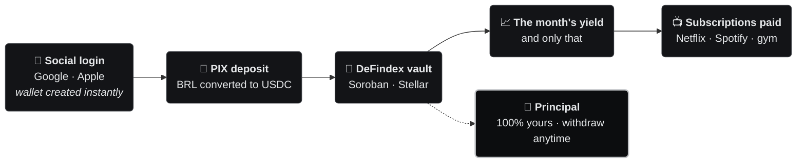
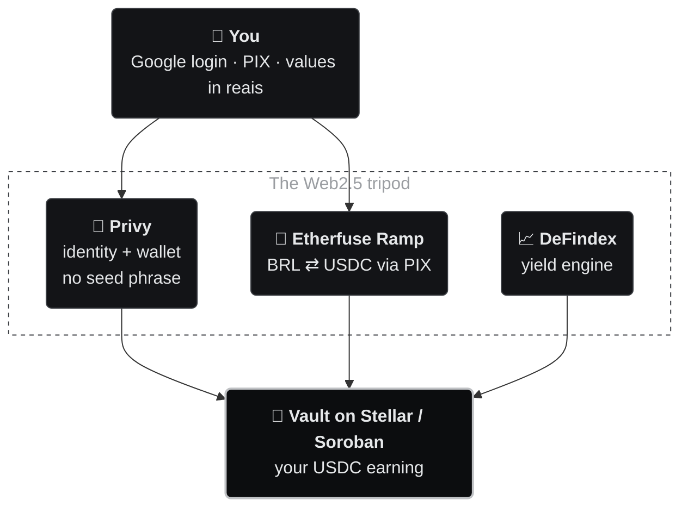
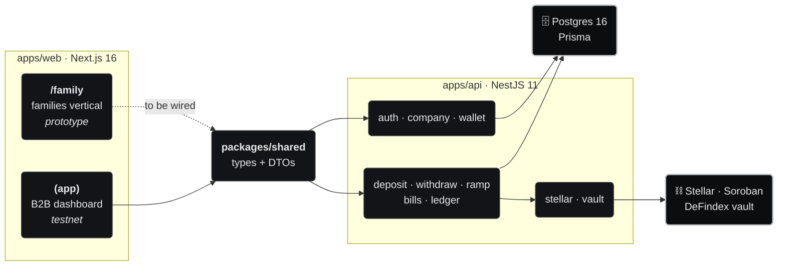
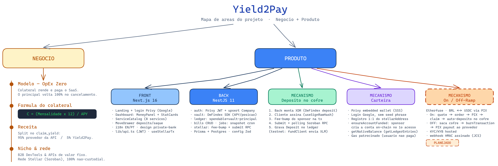

<div align="center">

# Yield2Pay

### The yield on your own money pays your subscriptions.<br/>And the money stays yours.

You deposit once. It earns yield in a DeFi vault on Stellar.<br/>
**Only the yield** pays Netflix, Spotify, ChatGPT, the gym.<br/>
The principal stays **100% yours** — withdraw it whenever you want.

<br/>


[🇧🇷 Português](README.md) · **🇺🇸 English**

<br/>

[**The idea**](#-the-idea-in-30-seconds) · [**Freedom percentage**](#-freedom-percentage) · [**How it works**](#-how-it-works) · [**The screens**](#-the-family-screens) · [**Architecture**](#-architecture) · [**Roadmap**](#-roadmap) · [**Run it**](#-run-it-locally)

</div>

> [!NOTE]
> **Restructuring in progress.** Yield2Pay started out 100% B2B — a company's idle cash paid for its
> own SaaS. We're opening a **financial-freedom vertical for individuals, couples and families**:
> the same yield engine, now paying everyday subscriptions. The families vertical now **leads** the
> product; [corporate treasury](#-corporate-treasury-b2b--complementary-product) continues as a
> **complementary** product. Both run on the same non-custodial infrastructure.

---

## 💡 The idea in 30 seconds

Every household carries a stack of monthly bills. That money leaves and never comes back. This flips
the math: instead of **spending** the money, you **deposit** it and let it earn. Only the yield pays
the bills — the principal is never spent.

|  | Without Yield2Pay | With Yield2Pay |
|---|---|---|
| **Where the money sits** | Leaves your account every month | Stays yours, earning in a vault |
| **Who pays for Netflix** | You, out of pocket | The yield on your deposit |
| **After 12 months** | Spent, nothing to show | Principal intact, withdraw anytime |
| **Who holds the money** | The bank / the app | **You** — the wallet and keys are yours |

This is not an investment with a promised return: it's a **payment tool**. The yield is variable, it
can be zero, and the goal is one thing only — making your own money cover your own recurring bills.

<sub>*Baseline: Netflix R$ 59.90 + Spotify Family R$ 34.90 + language school R$ 189.00 = R$ 283.80/month.*</sub>

---

## 🎯 Freedom percentage

The product's core metric: **how much of your monthly bills the yield alone already covers.** It
runs from 0% (covers nothing) to 100% (the subscriptions pay for themselves).

```
monthly_yield     =  deposit × annual_rate ÷ 12
deposit_needed    =  monthly_bill × 12 ÷ annual_rate
freedom           =  monthly_yield ÷ monthly_bill × 100      (capped at 100%)
```

With **R$ 400/month** in subscriptions, at an **8%/yr** scenario:

| Deposited | Earns per month | Covers of your bills | Freedom |
|---:|---:|:---|:---|
| R$ 18,000 | R$ 120 | `███░░░░░░░` | **30%** |
| R$ 36,000 | R$ 240 | `██████░░░░` | **60%** |
| R$ 48,000 | R$ 320 | `████████░░` | **80%** |
| **R$ 60,000** | **R$ 400** | `██████████` | **100%** · they pay for themselves |

The subscription list is **ordered by priority**: the month's yield covers it top-down, and a bill
only counts as *covered* once the running total up to it fits inside the monthly yield. The
**reverse calculator** works backwards — given what you want covered, how much is still missing.

<sub>Implementation: [`familyMath.ts`](apps/web/src/app/family/_lib/familyMath.ts) — `monthlyYieldOf`, `depositForMonthly`, `freedomPercent`, `coverageRows`.</sub>

---

## 🔄 How it works



1. **Social login** (Google/Apple) → wallet created automatically, no seed phrase.
2. **PIX deposit** → converted to **USDC** → allocated to the **DeFindex** vault (Soroban).
3. **Register your subscriptions** — name, amount, due date.
4. **Reverse calculator** — how much more you'd need to deposit to cover each bill.
5. **Dashboard** — freedom percentage, balance, yield and history.

---

## 📱 The `/family` screens

Eight routes, bilingual (PT/EN), walkable end to end in
[`apps/web/src/app/family/`](apps/web/src/app/family/):

| Route | What it does |
|---|---|
| [`/family`](apps/web/src/app/family/page.tsx) | Landing: hero, **freedom calculator**, how it works, what's behind it, waitlist |
| [`/family/onboarding`](apps/web/src/app/family/onboarding/) | Account and wallet setup |
| [`/family/deposito`](apps/web/src/app/family/deposito/) | PIX deposit (`PixDepositCard`) |
| [`/family/dashboard`](apps/web/src/app/family/dashboard/) | Freedom percentage, balance, subscriptions, history |
| [`/family/dashboard/[subId]`](apps/web/src/app/family/dashboard/) | Single-subscription detail |
| [`/family/saque`](apps/web/src/app/family/saque/) | Principal withdrawal |
| [`/family/conceitos`](apps/web/src/app/family/conceitos/) | Wallet, stablecoin, yield + FAQ |
| [`/family/configuracoes`](apps/web/src/app/family/configuracoes/) | Profile, security, wallet, PIX, subscriptions, notifications, privacy (LGPD) |

> [!IMPORTANT]
> **What is NOT wired up yet.** These screens are **frontend only**. The numbers are computed
> client-side, with **no Privy, DeFindex or PIX behind them** in this vertical, and the waitlist only
> validates the email and shows a "sent" state — nothing is persisted. The real backend (auth,
> deposit, withdraw, bills, ledger) **already runs on testnet** for the B2B product; what's missing
> is **wiring the family screens into it** — see the [roadmap](#-roadmap).

<details>
<summary><b>Internal structure of the vertical</b></summary>

```
apps/web/src/app/family/
├── page.tsx           → landing + calculator
├── layout.tsx         → FamilyProvider (client-side state, no AuthGate)
├── family.css         → vertical theme
├── _lib/
│   ├── familyMath.ts     → freedom percentage (coverage, reverse calculator)
│   ├── familyI18n.ts     → PT dictionary (source) + EN
│   ├── familyStore.ts    → screen state (deposit, subscriptions, preferences)
│   ├── FamilyProvider.tsx
│   ├── familyTheme.ts
│   └── familyFormat.ts   → currency and date formatting
└── _components/
    ├── FamilyUI.tsx         → visual primitives for the vertical
    ├── DashboardHeader.tsx
    └── PixDepositCard.tsx
```

Tests: `familyMath.test.ts`, `familyFormat.test.ts`, `family.test.tsx`.

</details>

---

## 🧩 What's behind it

The blockchain hides behind a Web2 experience — Google login, PIX, values in reais. Three pieces
hold that up:



| Pillar | Role | Why this way |
|---|---|---|
| **Privy** | Embedded wallet via Google/Apple login. Split key — only you sign. | No seed phrase, no extension: the crypto entry barrier disappears. |
| **Etherfuse Ramp** | BRL ↔ USDC over **PIX**. *Hosted* KYC/KYB. | The platform **never touches BRL**; the user pays an ordinary PIX. |
| **DeFindex** | Indexed vaults on Soroban capturing the network's APY. | Yield comes from open, audited protocols — not from a promise of ours. |

---

## 🏗️ Architecture

**pnpm workspaces** monorepo (`pnpm@10.33.2`): two apps and one shared-types package.



Full map of project areas (business + product):



<sub>Editable source: [`docs/diagrams/arquitetura-geral.excalidraw`](docs/diagrams/arquitetura-geral.excalidraw) (labels in Portuguese)</sub>

**Three decisions that explain the rest:**

- **Non-custodial by design.** The backend only **builds** the transaction (XDR) and **submits** the
  signature that came from the client. The private key never passes through the server.
- **Fee-bump sponsor.** Every client transaction is wrapped in a `FeeBumpTransaction` — the user
  never needs XLM for gas. The sponsor also creates their Stellar account on first access.
- **Money as `BigInt`, never `float`.** Values in 7-decimal base units (Stellar/USDC standard); a
  `BigInt.prototype.toJSON` shim serializes to string in the API.

<details>
<summary><b>apps/api — backend modules</b></summary>

```
apps/api/src/
├── main.ts       → bootstrap: port, CORS, global ValidationPipe, BigInt.toJSON shim
├── config/       → env validation with Zod (fails at boot if a variable is missing)
├── prisma/       → PrismaService (connection lifecycle, Postgres adapter)
├── auth/         → AuthGuard: verifies the Privy JWT and upserts the Company on login
├── company/      → Company lifecycle (idempotent upsert by privyUserId)
├── wallet/       → 1:1 Stellar address record; creates and funds the on-chain account
├── vault/        → DeFindex SDK wrapper (build deposit/withdraw, APY, position)
├── stellar/      → fee-bump sponsor, account creation, on-chain balance, submit + RPC polling
├── deposit/      → deposit flow (fund client → build XDR → sign → submit)
├── withdraw/     → withdrawal (mirror of deposit)
├── ramp/         → Etherfuse ramp: PIX ⇄ USDC on/off-ramp, claim/burn, orders
├── bills/        → recurring subscription CRUD
├── ledger/       → principal, real vault value, spendable yield, wallet balance
├── jobs/         → daily cron (state snapshot per account at 2am)
├── health/       → GET /health
└── common/       → pure utilities (parse-money, exception filter)
```

Each folder is a self-contained module with its own `.spec.ts` — you can test and evolve one flow
without touching the others.

</details>

<details>
<summary><b>Data model (Prisma + Postgres)</b></summary>

| Model | Purpose | Key fields |
|---|---|---|
| **Company** | Account (1:1 with a Privy user) | `privyUserId` (unique) |
| **EtherfuseCustomer** | Ramp customer (1:1 with Company) | `customerId`, `kycStatus`, `bankAccountId` |
| **RampOrder** | On/off-ramp order | `orderId` (unique), `type`, `status`, `amountFiat`, `burnTransaction` |
| **Wallet** | Stellar address (1:1) | `stellarAddress` (unique) |
| **Deposit** | Vault deposit history | `amount` (BigInt), `txHash` (unique) |
| **RecurringBill** | Subscriptions | `vendor`, `monthlyCost` (BigInt), `type`, `status` |
| **YieldSnapshot** | Daily state | `vaultValue`, `principal`, `spendable` (BigInt) |

When the families vertical is wired in, it reuses this same core — and that's where the
**"author" field per movement** comes in (see [product decisions](#-product-decisions)).

</details>

<details>
<summary><b>apps/web — frontend and design system</b></summary>

```
apps/web/src/
├── app/
│   ├── page.tsx      → public landing (bilingual EN/PT)
│   ├── login/        → Google OAuth via Privy
│   ├── family/       → families vertical (prototype)
│   ├── tokens/       → design tokens as CSS custom properties (--fx-*)
│   └── (app)/        → authenticated B2B route group (AuthGate + LangProvider)
│       ├── dashboard/  → MoneyPanel (wallet ↔ real vault), 8-service catalog
│       ├── deposit/    → 3-step wizard
│       └── withdraw/   → withdrawal flow
├── components/       → MetalCard, Button, Input, Badge, ErrorDialog…
├── lib/              → api.ts (fetch + JWT), money.ts, hooks, i18n, errors
└── providers/        → Providers, PrivyProviderWrapper, AuthGate, ErrorDialogProvider
```

- **No Tailwind, no charting library.** Styling via **design tokens** (`--fx-*`) + inline styles.
  "Private bank" aesthetic: monochrome black/silver, brushed-metal surfaces, dark mode. The
  dashboard chart is pure CSS.
- **`/family` sits outside the `AuthGate`** — it runs with no credentials at all, which makes the
  vertical walkable in any clone of the repo.
- **`packages/shared`** defines the contract once (`Bill`, `SpendableView`, tx DTOs) and both sides
  consume it: end-to-end type safety without publishing an SDK.

Versioned visual reference in [`design/`](design/): `tokens/`, `components/`, `ui_kits/`
(high-fidelity HTML screens), `nemPages/` (error screens), `guidelines/`, `docs/`.

</details>

<details>
<summary><b>Infra and deploy</b></summary>

| File | Role | Why |
|---|---|---|
| `docker-compose.yml` | Local Postgres 16 on port **5433** | Doesn't clash with the host's Postgres (5432). |
| `apps/api/Dockerfile` | Multi-stage build, runs `prisma migrate deploy` on start | Migrations applied automatically on deploy. |
| `render.yaml` | Managed Postgres + API in Docker, health `/health` | One-click reproducible backend. |
| `docs/DEPLOY.md` | Web → **Vercel**, API + DB → **Render** | Split deploy: SSR on Vercel, container on Render. |

</details>

---

## 🧰 Stack


**Tests:** Vitest on both apps. On the backend, specs per service/guard plus **opt-in** integration
tests (`RUN_INTEGRATION=1`) hitting the real testnet. On the frontend, Vitest + Testing Library
covering hooks, utils, components, error screens and the `/family` math.

---

## 📐 Product decisions

| Decision | What we settled on | Why |
|---|---|---|
| **Single currency: USDC** | XLM and USDT dropped | Don't expose the user to **FX**. Someone saving in reais wants predictability, and one stablecoin keeps the mental model simple. |
| **No family vault in the MVP** | Individual accounts | Shared custody (several people on one wallet) brings signing complexity the MVP can't carry. **Deferred, not dropped.** |
| **"Author" field from day one** | Every movement records who made it | Even without a family vault today, this lets us migrate to family accounts **without rewriting history**. |

---

## 🗺️ Roadmap

**Where we are:** the B2B product runs **end to end on Stellar testnet** — Privy auth, automatic
account creation and funding, gas sponsored via fee-bump, real deposits/withdrawals in the DeFindex
vault, on-chain balance, service catalog, bills and a daily snapshot. The **Etherfuse ramp**
(PIX ⇄ USDC) is **coded and wired** into deposit and withdrawal, running against the **sandbox** —
with automatic *mock mode* when the API key is absent. The **families** vertical is a **frontend
prototype**. The custom escrow contract remains **specified, not coded**.

### Families vertical

| | Item | Status |
|:---:|---|---|
| 🎨 | `/family` screens — 8 routes, PT/EN, complete flows | ✅ **walkable prototype** |
| 🔌 | Wire `/family` into the backend (auth · deposit · withdraw · bills · ledger) | 🚧 **next** |
| 💾 | Persist the freedom percentage server-side (today client-only) | 📋 planned |
| 👤 | **"Author"** field on every movement (prepares family accounts) | 📋 planned |
| ✉️ | Wire up the waitlist (today it only validates and shows "sent") | 📋 planned |
| 🔑 | Google/Apple social login connected to Privy in the vertical | 📋 planned |

### On-chain and ramp — shared with B2B

| | Item | Status |
|:---:|---|---|
| 🏧 | **Etherfuse ramp** (BRL↔USDC over PIX): `ramp/` module, on/off-ramp, claim/burn, `RampOrder` | ✅ **coded, sandbox** |
| 🔔 | **HMAC webhook** from Etherfuse — status comes from *polling* + `POST /ramp/onramp/simulate` today | 📋 planned |
| 🔐 | Production Etherfuse key (KYB approved) to leave the sandbox | 📋 planned |
| 📜 | **Custom escrow contract (Soroban)**: `deposit_collateral`, `claim_yield` (95/5 split), `cancel_subscription` + events | 📋 not in the repo yet |
| ⚙️ | Automated billing engine (`claim_yield` on due date → split → off-ramp) | 📋 planned |
| ✂️ | Pro-rata on cancellation and access revocation via on-chain event (B2B) | 📋 planned |

<details>
<summary><b>Test and review</b></summary>

**Test**
- [ ] **Opt-in** integration (`RUN_INTEGRATION=1`) with real credentials — pins down 3 third-party
      unknowns: the return field of `verifyAuthToken` (Privy); **shares → USDC** conversion in
      `getPositionValue` (DeFindex); the real `prepare`/`submit` path on the Soroban RPC.
- [ ] Deferred test in `apps/api/test/vault.integration-spec.ts` (swap `dfTokens` for
      `underlyingBalance[0]` once the vault math settles).
- [ ] Deposit E2E (`build → sign → submit → assert position`) — needs Privy credentials.
- [ ] Per-screen visual verification (Playwright) against `design/`.

**Review**
- [ ] **CORS:** without `CORS_ORIGIN` the backend reflects **any origin** (marked "MVP only" in
      `main.ts`). Pin the Vercel origin before production.
- [ ] **Production secrets** on Render/Vercel: `PRIVY_*`, `DEFINDEX_API_KEY`, `VAULT_ADDRESS`,
      `USDC_ADDRESS`, `CORS_ORIGIN`, `NEXT_PUBLIC_*`, `ETHERFUSE_*` (see `docs/DEPLOY.md`).
- [ ] **Testnet → mainnet:** requires a funded DeFindex vault, a production Etherfuse key (KYB
      approved) and `STELLAR_NETWORK=public`.

</details>

---

## 🏢 Corporate treasury (B2B) — complementary product

Where the project started, and what still stands. Same non-custodial infrastructure; what changes is
the audience (companies) and the size of the collateral.

**The OpEx Zero thesis:** instead of paying a SaaS/API subscription out of cash, the company **locks
collateral** in stablecoins inside a DeFi vault. Only the yield settles the subscription; the
principal stays available for full redemption on cancellation.

> *"Your idle cash pays for your software, and the cash stays yours."*

```
C = (M × 12) / Y_annual
```

**Example:** an R$ 500/month API (R$ 6,000/yr) at 12%/yr → collateral **C = R$ 50,000**. The yield
covers all 12 payments; the R$ 50,000 stays intact. It's the freedom percentage seen from the
company's side.

<details>
<summary><b>B2B flow lifecycles</b></summary>

**Inbound (PIX → vault):** the app requests a *quote* and creates an *order* on Etherfuse → the
client pays the PIX → Etherfuse delivers USDC to the Privy wallet via *claimable balance* → the
client signs one tx with `ChangeTrust` + `ClaimClaimableBalance` → auto-deposit into the DeFindex
vault.

**Yield distribution:** on the due date the protocol redeems **only the period's profit**, splits
revenue (95% provider / 5% Yield2Pay) and triggers the off-ramp (client signs the `burnTransaction`
→ Etherfuse sends the PIX to the provider). The principal is untouched.

**Outbound (cancellation):** the client signs `cancel_subscription` → the vault returns the principal
→ pro-rata yield for days used → PIX refund to the company. API access is revoked by reading the
on-chain event.

In the current MVP the backend implements the core of this flow on testnet: on/off-ramp through the
`ramp/` module (Etherfuse sandbox, *mock mode* without an API key), direct vault deposit/withdrawal,
*spendable = vault value − principal*, Stellar account creation and funding, and gas via fee-bump.
The custom escrow remains on the [roadmap](#-roadmap).

</details>

---

## ⚡ Run it locally

```bash
pnpm install
pnpm db:up            # local Postgres on port 5433
pnpm db:migrate       # apply migrations
pnpm dev:app          # web + api in parallel
```

Tests:

```bash
pnpm test             # both apps' suites
pnpm api:test         # backend only
pnpm web:test         # frontend only
```

Configure `apps/api/.env` and `apps/web/.env.local` from their respective `*.example` files.

> [!TIP]
> The **`/family` vertical runs with no credentials at all** — it's frontend only. Just `pnpm dev:web`
> and open `http://localhost:3000/family`. The authenticated screens (`/login`, `(app)`) need a real
> `NEXT_PUBLIC_PRIVY_APP_ID`.

---

## 📚 Documentation

Most documents are written in Portuguese.

**Product and business**
- [`docs/FAQ.md`](docs/FAQ.md) — FAQ, including the families vertical.
- [`docs/PITCH.md`](docs/PITCH.md) — pitch: problem, solution, model, what already exists.
- [`docs/GTM.md`](docs/GTM.md) — go-to-market: ICP, channels, pricing, roadmap.
- [`docs/GUIA-DO-USUARIO.md`](docs/GUIA-DO-USUARIO.md) — end-user onboarding guide.
- [`docs/PROMPT-PITCH-SLIDES.md`](docs/PROMPT-PITCH-SLIDES.md) — pitch-deck script.

**Technical**
- [`docs/Yield2Pay_Documentacao_Tecnica.md`](docs/Yield2Pay_Documentacao_Tecnica.md) — full spec
  (§8: implemented-on-testnet vs. planned status table).
- [`docs/DEPLOY.md`](docs/DEPLOY.md) — deploy guide (Vercel + Render).
- [`docs/CHECKLIST-TESTES-INTEGRACOES.md`](docs/CHECKLIST-TESTES-INTEGRACOES.md) — third-party
  integration test checklist.
- [`docs/superpowers/specs/`](docs/superpowers/specs/) — verified designs (Etherfuse ramp).
- [`docs/superpowers/plans/`](docs/superpowers/plans/) — task-by-task implementation plans.

---

## ⚖️ License

[MIT](LICENSE) — © 2026 Tiago de Pauli Alcantara.

---

<div align="center">

<sub>Yield2Pay started life as **FixEarn** and was renamed across the whole monorepo — brand, packages, infra and database.</sub>

<sub>A non-custodial payment tool. We are not a financial institution and do not manage third-party
funds. Yield is variable and can be zero. The figures on this page are simulations, not projections
or promises.</sub>

</div>
