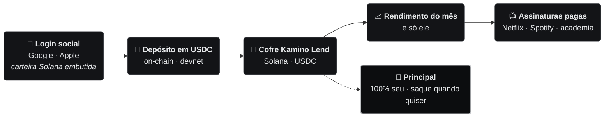
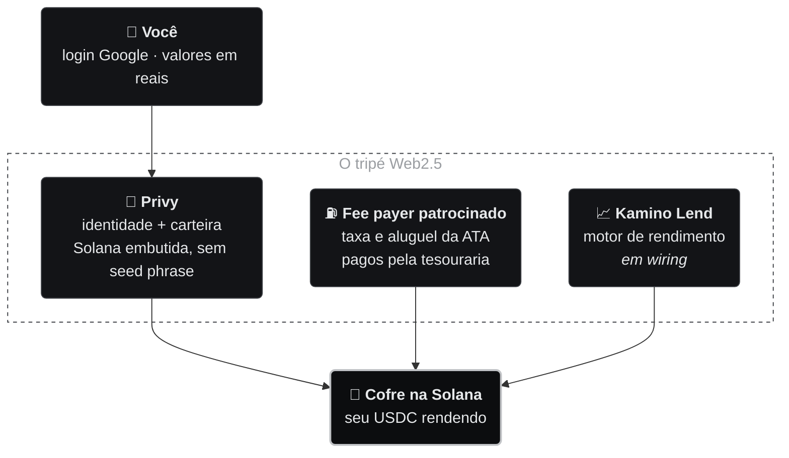
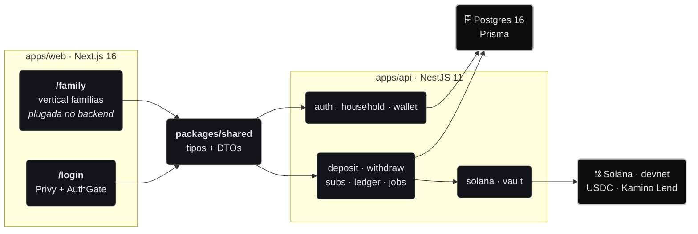

<div align="center">

# Yield2Pay · Solana

### O rendimento do seu dinheiro paga suas assinaturas.<br/>E o dinheiro continua sendo seu.

Você deposita uma vez. O dinheiro rende num cofre DeFi na rede Solana.<br/>
**Só o rendimento** paga Netflix, Spotify, ChatGPT, academia.<br/>
O principal continua **100% seu** — e sai quando você quiser.

<br/>


-2ea44f?style=for-the-badge&labelColor=0c0d0f)

**🇧🇷 Português** · [🇺🇸 English](README.en.md)

<br/>

[**A ideia**](#-a-ideia-em-30-segundos) · [**Percentual de Liberdade**](#-percentual-de-liberdade) · [**Como funciona**](#-como-funciona) · [**As telas**](#-as-telas-family) · [**Arquitetura**](#-arquitetura) · [**Roadmap**](#-roadmap) · [**Rodar**](#-rodar-local)

</div>

---

## 💡 A ideia em 30 segundos

Toda casa tem uma pilha de mensalidades. Esse dinheiro sai e não volta. A proposta inverte a conta:
em vez de **gastar** o dinheiro, você **deposita** e deixa ele render. Só o rendimento paga as
contas — o principal nunca é gasto.

|  | Sem Yield2Pay | Com Yield2Pay |
|---|---|---|
| **Onde o dinheiro fica** | Sai da sua conta todo mês | Fica seu, rendendo num cofre |
| **Quem paga a Netflix** | Você, R$ 59,90 do bolso | O rendimento do seu depósito |
| **Depois de 12 meses** | R$ 3.405 gastos, nada de volta | Principal intacto, saque quando quiser |
| **Quem guarda o dinheiro** | O banco / o app | **Você** — a carteira e as chaves são suas |

Não é investimento com promessa de retorno: é uma **ferramenta de pagamento**. O rendimento é
variável, pode ser zero, e o objetivo é um só — fazer o seu próprio dinheiro cobrir as suas contas
recorrentes.

<sub>*Base: Netflix R$ 59,90 + Spotify Família R$ 34,90 + escola de inglês R$ 189,00 = R$ 283,80/mês.*</sub>

---

## 🎯 Percentual de Liberdade

A métrica central do produto: **quanto das suas contas do mês o rendimento sozinho já cobre.**
Vai de 0% (não cobre nada) a 100% (as assinaturas se pagam sozinhas).

```
rendimento_mensal    =  depósito × taxa_anual ÷ 12
depósito_necessário  =  mensalidade × 12 ÷ taxa_anual
liberdade            =  rendimento_mensal ÷ mensalidade × 100      (teto de 100%)
```

Com **R$ 400/mês** de assinaturas, a um cenário de **8% a.a.**:

| Depositado | Rende por mês | Cobre das suas contas | Liberdade |
|---:|---:|:---|:---|
| R$ 18.000 | R$ 120 | `███░░░░░░░` | **30%** |
| R$ 36.000 | R$ 240 | `██████░░░░` | **60%** |
| R$ 48.000 | R$ 320 | `████████░░` | **80%** |
| **R$ 60.000** | **R$ 400** | `██████████` | **100%** · se pagam sozinhas |

A lista de assinaturas é **ordenada por prioridade**: o rendimento do mês cobre de cima para
baixo, e uma conta só entra como *coberta* quando o acumulado até ela cabe dentro do rendimento.
A **calculadora reversa** faz o caminho inverso — dado o que você quer cobrir, quanto falta
depositar.

<sub>Implementação: [`familyMath.ts`](apps/web/src/app/family/_lib/familyMath.ts) — `monthlyYieldOf`, `depositForMonthly`, `freedomPercent`, `coverageRows`.</sub>

---

## 🔄 Como funciona



1. **Login social** (Google/Apple) → carteira Solana embutida criada pelo Privy, sem seed phrase.
2. **Registro da carteira** → o backend valida o endereço e cria a **ATA de USDC** da família —
   aluguel e taxas pagos pela tesouraria (fee payer patrocinado).
3. **Depósito em USDC** → o backend monta a transação patrocinada, o cliente assina na carteira
   embutida, o valor entra no cofre. *A rampa PIX ⇄ USDC volta no roadmap — hoje o aporte é
   direto em USDC (devnet).*
4. **Cadastro das assinaturas** — nome, valor, dia de vencimento, ordem de prioridade, quem usa.
5. **Dashboard** — Percentual de Liberdade, saldo, rendimento e histórico.

---

## 📱 As telas `/family`

Oito rotas, bilíngues (PT/EN), **responsivas no mobile** (escala centralizada em variáveis
`--fam-*`, quebra única em 640px) e navegáveis de ponta a ponta em
[`apps/web/src/app/family/`](apps/web/src/app/family/):

| Rota | O que faz |
|---|---|
| [`/family`](apps/web/src/app/family/page.tsx) | Landing: hero, **calculadora de liberdade**, como funciona, o que está por trás, CTA de login |
| [`/family/onboarding`](apps/web/src/app/family/onboarding/) | Abertura de conta e carteira |
| [`/family/deposito`](apps/web/src/app/family/deposito/) | Depósito em USDC (`UsdcDepositCard`) |
| [`/family/dashboard`](apps/web/src/app/family/dashboard/) | Percentual de Liberdade, saldo, assinaturas, histórico |
| [`/family/dashboard/[subId]`](apps/web/src/app/family/dashboard/) | Detalhe de uma assinatura |
| [`/family/saque`](apps/web/src/app/family/saque/) | Saque do principal |
| [`/family/conceitos`](apps/web/src/app/family/conceitos/) | Carteira, moeda estável, rendimento + FAQ |
| [`/family/configuracoes`](apps/web/src/app/family/configuracoes/) | Perfil, segurança, carteira, assinaturas, notificações, privacidade (LGPD) |

> [!IMPORTANT]
> **O que já está ligado, e o que ainda é mock.** As telas autenticadas (`/family/dashboard`,
> `/family/deposito`, `/family/saque`, e a aba **Assinaturas** de `/family/configuracoes`) já
> rodam contra o **backend real na devnet**: login Privy de verdade, carteira Solana embutida
> criada e registrada no backend, depósito/saque como transação patrocinada assinada pelo
> cliente, e a lista de assinaturas via API/Postgres. Não sobrou nada de front-puro nesse
> caminho. O que **ainda é mock**, de propósito, por não ser core do fluxo financeiro: as demais
> abas de Configurações (perfil, segurança, notificações, privacidade) guardam estado só no
> `localStorage` do navegador (`familyStore.ts`), e o extrato de movimentações em "Carteira" é
> um exemplo fixo. A calculadora da landing (`/family`) é simulação client-side por natureza —
> ilustra o produto antes do login, não é dado de ninguém.

> [!WARNING]
> **Kamino não roda em devnet.** O oracle que toda reserve Kamino Lend exige
> (Scope, `HFn8GnPADiny6XqUoWE8uRPPxb29ikn4yTuPa9MF2fWJ`) não está deployado
> em devnet — confirmado consultando o programa on-chain diretamente. Sem
> Scope, nenhuma reserve Kamino funciona nesse cluster; usar Kamino de
> verdade exige mainnet (ou o ambiente de staging da Kamino, que também roda
> sobre infraestrutura mainnet). Por isso a devnet deste repo testa o fluxo
> completo (depósito, saque, dashboard) com um **cofre mock**
> (`VAULT_PROVIDER=mock`): dois SPL tokens de teste — uma moeda "Real de
> teste" no lugar de USDC e um token de cota — sem rendimento real e sem
> depender de nenhum faucet externo. Ver
> [`docs/superpowers/plans/2026-09-04-mock-vault-devnet.md`](docs/superpowers/plans/2026-09-04-mock-vault-devnet.md).

<details>
<summary><b>Estrutura interna da vertical</b></summary>

```
apps/web/src/app/family/
├── page.tsx           → landing + calculadora
├── layout.tsx         → FamilyProvider (estado no cliente, sem AuthGate)
├── family.css         → tema da vertical + escala responsiva (--fam-*)
├── _lib/
│   ├── familyMath.ts     → Percentual de Liberdade (cobertura, calculadora reversa)
│   ├── familyI18n.ts     → dicionário PT (fonte) + EN
│   ├── familyStore.ts    → estado das telas (depósito, assinaturas, preferências)
│   ├── FamilyProvider.tsx
│   ├── familyTheme.ts
│   └── familyFormat.ts   → formatação de reais e datas
└── _components/
    ├── FamilyUI.tsx         → primitivas visuais da vertical
    ├── DashboardHeader.tsx
    ├── DashboardSidebar.tsx → nav lateral fixa do dashboard
    └── UsdcDepositCard.tsx  → aporte direto em USDC (onboarding e painel)
```

Testes: `familyMath.test.ts`, `familyFormat.test.ts`, `family.test.tsx`, `useFamilyData.test.tsx`,
`UsdcDepositCard.test.tsx`.

</details>

---

## 🧩 O que está por trás

A blockchain fica escondida atrás de uma experiência Web2 — login Google, valores em reais.
Três peças sustentam isso:



| Pilar | Papel | Por que assim |
|---|---|---|
| **Privy** | Embedded wallet Solana via login Google/Apple. O cliente é o único que assina. | Sem seed phrase e sem extensão — a barreira de entrada da cripto desaparece. |
| **Fee payer patrocinado** | A tesouraria monta cada transação como fee payer e assina parcialmente; o aluguel da ATA de USDC também é dela. | O usuário nunca precisa de SOL — na Solana não existe fee-bump: quem paga a taxa é o fee payer da transação. |
| **Kamino Lend** | Reserve de USDC de um market Kamino capturando o APY de lending. | O rendimento vem de protocolo aberto e auditado, não de promessa nossa. |

---

## 🏗️ Arquitetura

Monorepo **pnpm workspaces** (`pnpm@10.33.2`): dois apps e um pacote de tipos compartilhados.



Mapa completo de áreas do projeto (negócio + produto):


<sub>Fonte editável: [`docs/diagrams/arquitetura-geral.excalidraw`](docs/diagrams/arquitetura-geral.excalidraw)</sub>

**Três decisões que explicam o resto:**

- **Não-custodial por design.** O backend só **monta** a transação (com a tesouraria como fee
  payer, parcialmente assinada) e **submete** a transação que o cliente assinou por completo na
  carteira embutida. A chave privada do usuário nunca passa pelo servidor — e há guarda no submit:
  transação cujo fee payer não é o sponsor é rejeitada.
- **Sponsor paga tudo on-chain.** Não existe fee-bump nem "criar conta" na Solana: o endereço já é
  uma conta de sistema. O que precisa existir (e pagar aluguel) é a **ATA de USDC** — criada de
  forma idempotente pelo sponsor no registro da carteira.
- **Dinheiro em `BigInt`, nunca `float`.** Valores em base units de 6 casas (padrão USDC na
  Solana); um shim `BigInt.prototype.toJSON` serializa para string na API.

<details>
<summary><b>apps/api — módulos do backend</b></summary>

```
apps/api/src/
├── main.ts       → bootstrap: porta, CORS, ValidationPipe global, shim BigInt.toJSON
├── config/       → validação de env com Zod (falha no boot se faltar variável)
├── prisma/       → PrismaService (ciclo de conexão, adapter Postgres)
├── auth/         → AuthGuard: verifica JWT do Privy; PrivyService encapsula o SDK
├── household/    → a conta da família (upsert idempotente por privyUserId no 1º login)
├── wallet/       → registro 1:1 do endereço Solana; valida, cria a ATA e lê o saldo USDC
├── solana/       → fee payer patrocinado: monta VersionedTransaction assinada pelo sponsor,
│                   envia + confirma; validação de endereço on-curve; saldo da ATA
├── vault/        → contrato do cofre Kamino Lend (build deposit/withdraw, APY, posição)
├── deposit/      → aporte (build instruções → tx patrocinada → cliente assina → submit → ledger)
├── withdraw/     → saque (espelho do aporte; lançamento negativo no ledger)
├── subs/         → CRUD de assinaturas + reordenação por prioridade
├── ledger/       → principal, valor do cofre, yield gastável, snapshot diário; modo demo
├── jobs/         → cron diário (snapshot de cada household às 2h, em paralelo)
├── health/       → GET /health
└── common/       → utilitários puros (parse-money, filtro de exceções, error-id)
```

Cada pasta é um módulo coeso — dá para testar e evoluir um fluxo sem tocar nos outros.

</details>

<details>
<summary><b>Modelo de dados (Prisma + Postgres)</b></summary>

| Modelo | Para que serve | Campos-chave |
|---|---|---|
| **Household** | A conta da família — o tenant de tudo (1:1 com usuário Privy) | `privyUserId` (único) |
| **Member** | Pessoa da família; o titular tem `privyUserId`, dependentes só nomeiam quem usa cada assinatura | `name`, `isOwner` |
| **Wallet** | Carteira Solana embutida (Privy) da família (1:1) | `solanaAddress` (único), `usdcTokenAccount` |
| **Deposit** | Histórico de aportes/saques no cofre | `amount` (BigInt, negativo no saque), `txSignature` (único) |
| **Sub** | Assinatura recorrente, com ordem de prioridade e membro que usa | `vendor`, `monthlyCost` (BigInt), `position` |
| **VaultPosition** | Posição no cofre Kamino (market/reserve) | `marketAddress`, `reserveAddress` |
| **YieldSnapshot** | Estado diário | `vaultValue`, `principal`, `spendable` (BigInt) |

</details>

<details>
<summary><b>🚨 Tratamento de erros — contrato ponta a ponta</b></summary>

- **Corpo único de erro** (`ApiErrorPayload` em `packages/shared`): toda exceção da API sai no
  mesmo formato — `statusCode` normalizado, `errorId` (`ERR-XXXX-XXXX`), `requestId` e timestamp.
- **`AllExceptionsFilter` global** (NestJS): log completo no servidor indexado pelo `errorId`;
  `technicalDetails` (método, endpoint, stack) só fora de produção — 5xx em produção troca a
  mensagem original por uma genérica.
- **Telas de erro no web**: `error.tsx`, `global-error.tsx`, `not-found.tsx` + componentes
  `ErrorPage` (tela cheia), `ErrorDialog` (popup) e `TechnicalPanel`.
- **`ErrorDialogProvider` + store `errorNotifications`**: toda falha do client de API abre o
  popup — um diálogo por vez, com dedup por status.
- **`APP_ENV`** (`production|staging|development`), separado do `NODE_ENV`; o painel técnico só
  entra no bundle em staging (`SHOW_TECHNICAL_DETAILS`, gate de build via `NEXT_PUBLIC_APP_ENV`).

</details>

<details>
<summary><b>apps/web — frontend e design system</b></summary>

```
apps/web/src/
├── app/
│   ├── page.tsx      → landing pública (bilíngue EN/PT)
│   ├── login/        → Google OAuth via Privy
│   ├── family/       → vertical famílias, plugada no backend real
│   ├── tokens/       → design tokens em CSS custom properties (--fx-*)
│   ├── error.tsx · global-error.tsx · not-found.tsx → rotas de erro
│   └── favicon.ico
├── components/       → MetalCard, Button, Input, Badge, ErrorDialog…
├── lib/              → api.ts (fetch + JWT), useWallet, useSolanaTx, money, hooks, i18n, errors
└── providers/        → Providers, PrivyProviderWrapper, AuthGate, ErrorDialogProvider
```

- **`AuthGate` provisiona a carteira**: após login Privy, chama `ensureWallet()` uma vez — cria a
  carteira Solana embutida e registra no backend.
- **Sem Tailwind, sem lib de gráfico.** Estilo por **design tokens** (`--fx-*`) + inline. Estética
  "private bank": monocromático preto/prata, superfícies brushed-metal, dark mode. Gráfico em CSS puro.
- **`/family` fica fora do `AuthGate`** — roda sem credencial nenhuma, o que torna a vertical
  navegável em qualquer clone do repo.
- **`packages/shared`** define o contrato uma vez (`Sub`, `SpendableView`, DTOs de tx) e os dois
  lados consomem: segurança de tipo ponta a ponta sem publicar SDK.

Referência visual versionada em [`design/`](design/).

</details>

<details>
<summary><b>Infra e deploy</b></summary>

| Arquivo | Papel | Por quê |
|---|---|---|
| `docker-compose.yml` | Postgres 16 local na porta **5433** | Não conflita com o Postgres do host (5432). |
| `apps/api/Dockerfile` | Build multi-stage, roda `prisma migrate deploy` no start | Migrations aplicadas automaticamente no deploy. |
| `render.yaml` | Postgres gerenciado + API em Docker, health `/health`, envs devnet | Backend reproduzível em um clique. |
| `docs/DEPLOY.md` | Web → **Vercel**, API + banco → **Render** | Deploy split: SSR na Vercel, container no Render. |

</details>

---

## 🧰 Stack


**Testes:** Vitest nos dois apps. No backend, specs dos utilitários e do filtro de exceções; no
frontend, Vitest + Testing Library cobrindo a API client, hooks (`useWallet`), providers
(`AuthGate`, `ErrorDialogProvider`), telas de erro, a landing e a matemática da vertical `/family`.

---

## 📐 Decisões de produto

| Decisão | O que ficou | Por quê |
|---|---|---|
| **Moeda única: USDC** | Stablecoin como única unidade de conta | Não expor a família ao câmbio. Quem guarda em reais quer previsibilidade. |
| **Cofre: Kamino Lend** | Reserve de USDC num market Kamino | Yield de lending em protocolo aberto e auditado, com posição resgatável a qualquer momento. |
| **Membros nomeiam, não logam** | `Member` é registro de nome; só o titular tem `privyUserId` | Cada assinatura sabe quem usa, sem a complexidade de custódia compartilhada no MVP. **Adiada, não descartada.** |
| **Gas sempre patrocinado** | Tesouraria como fee payer + aluguel da ATA | Família que chega pelo login Google nunca precisa comprar SOL. |

---

## 🗺️ Roadmap

**Onde estamos:** o backend da vertical famílias roda na **devnet Solana** — auth Privy com
household criada no primeiro login, registro de carteira com **ATA de USDC patrocinada**,
transações patrocinadas (fee payer) com guarda contra fee payer estranho, ledger com principal /
spendable / snapshot diário às 2h, CRUD + reordenação de assinaturas — e as telas de `/family`
(dashboard, depósito, saque, assinaturas) **já plugadas nesse backend de ponta a ponta**. O
**cofre Kamino Lend já usa o SDK real** (`@kamino-finance/klend-sdk`) em `vault/`, mas não roda em
devnet por falta do oracle Scope nesse cluster (ver aviso acima); por isso a devnet usa um cofre
mock (`VAULT_PROVIDER=mock`) com moeda de teste própria, e o **modo demo** (`DEMO_YIELD_BPS`)
injeta rendimento sintético quando necessário. Não há rampa fiat — o aporte é direto em USDC.

### Vertical famílias

| | Item | Status |
|:---:|---|---|
| 🎨 | Telas `/family` — 8 rotas, PT/EN, responsivas, fluxos completos | ✅ **plugadas, devnet** |
| 🔌 | Backend real por trás (auth · wallet · deposit · withdraw · subs · ledger) | ✅ **codado, devnet** |
| 🏦 | Cofre Kamino Lend com SDK real em `vault/` | ✅ **codado** · 🚧 precisa mainnet (sem oracle Scope em devnet) |
| 💾 | Persistir o Percentual de Liberdade como métrica no backend (hoje calculado no cliente, a partir de dado real da API) | 📋 planejado |
| 🧩 | Tirar do mock as demais abas de Configurações (perfil, segurança, notificações, privacidade — hoje só `localStorage`) | 📋 planejado |
| 👤 | Dependentes que logam (migração de `Member` para conta de verdade) | 📋 planejado |

### On-chain e dinheiro

| | Item | Status |
|:---:|---|---|
| ⛽ | Fee payer patrocinado + ATA idempotente + guarda no submit | ✅ **codado, devnet** |
| 📊 | Ledger: principal, spendable, snapshot diário, modo demo | ✅ **codado** |
| 🏧 | **Rampa fiat BRL ⇄ USDC** (hoje o aporte é só direto em USDC) | 📋 planejado |
| ⚙️ | Motor de cobrança automatizado (resgatar só o yield no vencimento → pagar a assinatura) | 📋 planejado |
| 📜 | Escrow próprio (programa Anchor) com split de receita | 📋 planejado |
| 🚀 | Devnet → mainnet-beta (RPC próprio, cofre financiado, limites revisados) | 📋 planejado |

<details>
<summary><b>Testar e revisar</b></summary>

**Testar**
- [x] E2E do aporte/saque na devnet (`build → cliente assina → submit → assert posição`) já roda
      hoje contra o **cofre mock** — falta o mesmo E2E contra a Kamino real, só possível em
      mainnet ou no ambiente de staging da Kamino.
- [ ] Cobertura de specs de `household`, `wallet`, `solana`, `deposit`, `subs` e `ledger` — hoje
      só `common/`, `config/` e `vault/` têm specs no backend.
- [ ] Verificação visual por tela contra o `design/`.

**Revisar**
- [ ] **CORS:** sem `CORS_ORIGIN`, o backend reflete **qualquer origem**. Fixar a origem da
      Vercel antes de produção.
- [ ] **Segredos de produção** no Render/Vercel: `PRIVY_*`, `KAMINO_*`, `FEE_SPONSOR_SECRET_KEY`,
      `CORS_ORIGIN` (ver `docs/DEPLOY.md`).
- [ ] **Teto de aporte:** `MAX_DEPOSIT_BASE_UNITS` hoje é 2.000 USDC — ainda conservador de
      propósito, revisar ao sair da devnet.
- [ ] **Chave da tesouraria:** `FEE_SPONSOR_SECRET_KEY` financia todo o gas — monitorar saldo.

</details>

---

## ⚡ Rodar local

```bash
pnpm install
pnpm db:up            # Postgres local na porta 5433
pnpm db:migrate       # aplica as migrations
pnpm dev:app          # web + api em paralelo
```

Testes:

```bash
pnpm test             # suíte dos dois apps
pnpm api:test         # só o backend
pnpm web:test         # só o frontend
```

Configure `apps/api/.env` e `apps/web/.env.local` a partir dos respectivos `*.example`.

> [!TIP]
> A **landing pública** (`/family`) roda sem credencial nenhuma — basta `pnpm dev:web` e abrir
> `http://localhost:3000/family`. Já as telas autenticadas (dashboard, depósito, saque,
> configurações, `/login`) precisam de um `NEXT_PUBLIC_PRIVY_APP_ID` real e do backend rodando.
> Para o fluxo completo na devnet: gere uma chave com `solana-keygen new` (formato id.json) para
> `FEE_SPONSOR_SECRET_KEY`, airdrop de SOL para ela e rode
> `node apps/api/scripts/create-mock-devnet-mints.cjs` uma vez para criar os mints de teste — depois
> `node apps/api/scripts/mint-test-currency.cjs <carteira> <valor>` para dar saldo de teste a uma
> carteira (não existe faucet de USDC real para devnet).

---

## 🚀 Caminho para mainnet

O que falta, de fato, pra este produto sair da devnet e rodar com dinheiro de verdade. Alguns
destes itens já aparecem soltos no [roadmap](#-roadmap) acima — aqui é o caminho concreto,
agrupado por frente.

**Infra e configuração**
- [ ] Trocar `SOLANA_CLUSTER`/`SOLANA_RPC_URL` para `mainnet-beta`, com um RPC pago (Helius,
      Triton etc. — o público não aguenta produção).
- [ ] Trocar `VAULT_PROVIDER=mock` por `kamino` — em mainnet o oracle Scope existe, então
      `KaminoVaultService` (já codado, já usa o SDK real) passa a funcionar de verdade.
- [ ] Apontar `KAMINO_MARKET_ADDRESS`/`KAMINO_RESERVE_ADDRESS` para um market/reserve de USDC
      real da Kamino.
- [ ] Trocar `USDC_MINT` do mint de teste pelo USDC real
      (`EPjFWdd5AufqSSqeM2qN1xzybapC8G4wEGGkZwyTDt1v`).
- [ ] Financiar a tesouraria (`FEE_SPONSOR_SECRET_KEY`) com SOL de verdade e montar monitoramento
      de saldo.
- [ ] Travar `CORS_ORIGIN` no domínio real de produção — hoje, sem essa env, o backend aceita
      qualquer origem.
- [ ] Segredos de produção reais no Render/Vercel (`PRIVY_*`, `KAMINO_*`) — ver `docs/DEPLOY.md`.
- [ ] Revisar `MAX_DEPOSIT_BASE_UNITS` (hoje 2.000 USDC, teto de MVP) para o valor real de
      produção.

**Produto**
- [ ] **Rampa PIX ⇄ USDC** — hoje o aporte é só USDC direto; família de verdade vai querer entrar
      e sair em reais.
- [ ] Motor de cobrança automatizado — resgatar só o yield no vencimento de cada assinatura e
      pagar sozinho, sem ação manual.
- [ ] Persistir o Percentual de Liberdade como métrica no backend (hoje é calculado no cliente,
      a partir de dado real da API).
- [ ] Dependentes que logam — migrar `Member` de registro de nome para conta de verdade.
- [ ] Escrow próprio (programa Anchor) com split de receita, se o modelo de negócio precisar
      reter parte do yield.

**Antes de abrir para usuários reais**
- [ ] E2E completo contra a Kamino real — só dá pra testar em mainnet ou no ambiente de staging
      da Kamino, devnet não tem o oracle.
- [ ] Cobertura de specs em `household`, `wallet`, `solana`, `deposit`, `subs`, `ledger` (hoje só
      `common/`, `config/` e `vault/` têm).
- [ ] Plano de rotação e custódia segura da chave da tesouraria — hoje é uma env var simples.

---

## 📚 Documentação

**Produto**
- [`docs/FAQ.md`](docs/FAQ.md) — perguntas frequentes.
- [`docs/GUIA-DO-USUARIO.md`](docs/GUIA-DO-USUARIO.md) — onboarding do cliente final.

**Técnica**
- [`docs/DEPLOY.md`](docs/DEPLOY.md) — deploy (Vercel + Render).
- [`docs/diagrams/`](docs/diagrams/) — arquitetura geral (Excalidraw editável + PNG).

---

## ⚖️ Licença

[MIT](LICENSE) — © 2026 Tiago de Pauli Alcantara.

---

<div align="center">

<sub>Ferramenta de pagamento não-custodial. Não somos instituição financeira e não administramos
recursos de terceiros. O rendimento é variável e pode ser zero. Os valores nesta página são
simulações, não projeções nem promessas.</sub>

</div>
