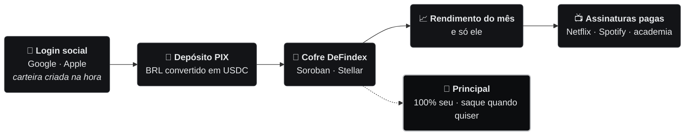
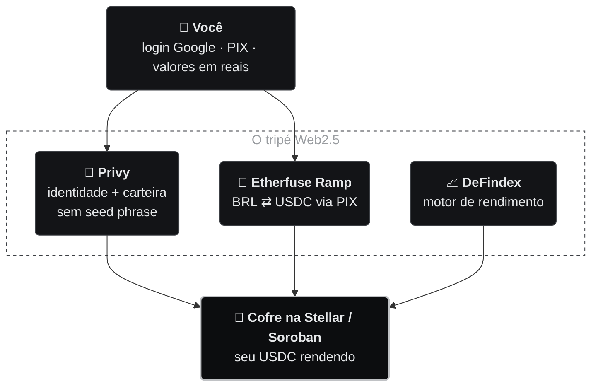
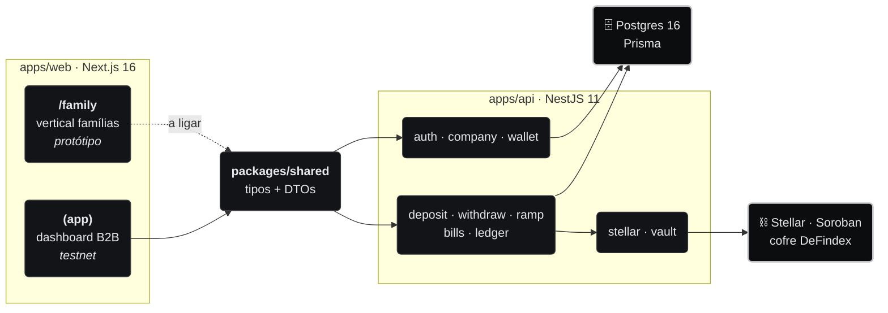

<div align="center">

# Yield2Pay

### O rendimento do seu dinheiro paga suas assinaturas.<br/>E o dinheiro continua sendo seu.

Você deposita uma vez. O dinheiro rende num cofre DeFi na rede Stellar.<br/>
**Só o rendimento** paga Netflix, Spotify, ChatGPT, academia.<br/>
O principal continua **100% seu** — e sai quando você quiser.

<br/>


**🇧🇷 Português** · [🇺🇸 English](README.en.md)

<br/>

[**A ideia**](#-a-ideia-em-30-segundos) · [**Percentual de Liberdade**](#-percentual-de-liberdade) · [**Como funciona**](#-como-funciona) · [**As telas**](#-as-telas-family) · [**Arquitetura**](#-arquitetura) · [**Roadmap**](#-roadmap) · [**Rodar**](#-rodar-local)

</div>

> [!NOTE]
> **Reestruturação em curso.** O Yield2Pay começou 100% B2B — o caixa ocioso da empresa pagava
> o SaaS dela. Estamos abrindo uma vertical de **liberdade financeira para pessoas, casais e
> famílias**: o mesmo motor de rendimento, agora pagando as assinaturas do dia a dia. A vertical
> famílias passa a **liderar** o produto; a [tesouraria corporativa](#-tesouraria-corporativa-b2b--produto-complementar)
> segue como produto **complementar**. Os dois rodam sobre a mesma infraestrutura não-custodial.

---

## 💡 A ideia em 30 segundos

Toda casa tem uma pilha de mensalidade. Esse dinheiro sai e não volta. A proposta inverte a conta:
em vez de **gastar** o dinheiro, você **deposita** e deixa ele render. Só o rendimento paga as
contas — o principal nunca é gasto.

|  | Sem Yield2Pay | Com Yield2Pay |
|---|---|---|
| **Onde o dinheiro fica** | Sai da sua conta todo mês | Fica seu, rendendo num cofre |
| **Quem paga a Netflix** | Você, R$ 59,90 do bolso | O rendimento do seu depósito |
| **Depois de 12 meses** | R$ 3.405 gastos, nada de volta | Principal intacto, saque quando quiser |
| **Quem guarda o dinheiro** | O banco / o app | **Você** — a carteira e as chaves são suas |

Não é investimento com promessa de retorno: é uma **ferramenta de pagamento**. O rendimento é
variável, pode ser zero, e o objetivo é um só — fazer o seu próprio dinheiro cobrir as suas contas
recorrentes.

<sub>*Base: Netflix R$ 59,90 + Spotify Família R$ 34,90 + escola de inglês R$ 189,00 = R$ 283,80/mês.*</sub>

---

## 🎯 Percentual de Liberdade

A métrica central do produto: **quanto das suas contas do mês o rendimento sozinho já cobre.**
Vai de 0% (não cobre nada) a 100% (as assinaturas se pagam sozinhas).

```
rendimento_mensal    =  depósito × taxa_anual ÷ 12
depósito_necessário  =  mensalidade × 12 ÷ taxa_anual
liberdade            =  rendimento_mensal ÷ mensalidade × 100      (teto de 100%)
```

Com **R$ 400/mês** de assinaturas, a um cenário de **8% a.a.**:

| Depositado | Rende por mês | Cobre das suas contas | Liberdade |
|---:|---:|:---|:---|
| R$ 18.000 | R$ 120 | `███░░░░░░░` | **30%** |
| R$ 36.000 | R$ 240 | `██████░░░░` | **60%** |
| R$ 48.000 | R$ 320 | `████████░░` | **80%** |
| **R$ 60.000** | **R$ 400** | `██████████` | **100%** · se pagam sozinhas |

A lista de assinaturas é **ordenada por prioridade**: o rendimento do mês cobre de cima para
baixo, e uma conta só entra como *coberta* quando o acumulado até ela cabe dentro do rendimento.
A **calculadora reversa** faz o caminho inverso — dado o que você quer cobrir, quanto falta
depositar.

<sub>Implementação: [`familyMath.ts`](apps/web/src/app/family/_lib/familyMath.ts) — `monthlyYieldOf`, `depositForMonthly`, `freedomPercent`, `coverageRows`.</sub>

---

## 🔄 Como funciona



1. **Login social** (Google/Apple) → carteira criada automaticamente, sem seed phrase.
2. **Depósito via PIX** → convertido em **USDC** → alocado no cofre **DeFindex** (Soroban).
3. **Cadastro das assinaturas** — nome, valor, dia de vencimento.
4. **Calculadora reversa** — quanto ainda falta depositar para cobrir cada conta.
5. **Dashboard** — Percentual de Liberdade, saldo, rendimento e histórico.

---

## 📱 As telas `/family`

Oito rotas, bilíngues (PT/EN), navegáveis de ponta a ponta em
[`apps/web/src/app/family/`](apps/web/src/app/family/):

| Rota | O que faz |
|---|---|
| [`/family`](apps/web/src/app/family/page.tsx) | Landing: hero, **calculadora de liberdade**, como funciona, o que está por trás, lista de espera |
| [`/family/onboarding`](apps/web/src/app/family/onboarding/) | Abertura de conta e carteira |
| [`/family/deposito`](apps/web/src/app/family/deposito/) | Depósito via PIX (`PixDepositCard`) |
| [`/family/dashboard`](apps/web/src/app/family/dashboard/) | Percentual de Liberdade, saldo, assinaturas, histórico |
| [`/family/dashboard/[subId]`](apps/web/src/app/family/dashboard/) | Detalhe de uma assinatura |
| [`/family/saque`](apps/web/src/app/family/saque/) | Saque do principal |
| [`/family/conceitos`](apps/web/src/app/family/conceitos/) | Carteira, moeda estável, rendimento + FAQ |
| [`/family/configuracoes`](apps/web/src/app/family/configuracoes/) | Perfil, segurança, carteira, PIX, assinaturas, notificações, privacidade (LGPD) |

> [!IMPORTANT]
> **O que ainda NÃO está ligado.** Estas telas são **front puro**. Os números são calculados no
> cliente, **sem Privy, DeFindex ou PIX por trás** nesta vertical, e a lista de espera só valida o
> e-mail e mostra o estado "enviado" — não persiste em lugar nenhum. O backend real
> (auth, depósito, saque, bills, ledger) **já roda em testnet** para o produto B2B; falta **plugar
> as telas famílias nele** — ver o [roadmap](#-roadmap).

<details>
<summary><b>Estrutura interna da vertical</b></summary>

```
apps/web/src/app/family/
├── page.tsx           → landing + calculadora
├── layout.tsx         → FamilyProvider (estado no cliente, sem AuthGate)
├── family.css         → tema da vertical
├── _lib/
│   ├── familyMath.ts     → Percentual de Liberdade (cobertura, calculadora reversa)
│   ├── familyI18n.ts     → dicionário PT (fonte) + EN
│   ├── familyStore.ts    → estado das telas (depósito, assinaturas, preferências)
│   ├── FamilyProvider.tsx
│   ├── familyTheme.ts
│   └── familyFormat.ts   → formatação de reais e datas
└── _components/
    ├── FamilyUI.tsx         → primitivas visuais da vertical
    ├── DashboardHeader.tsx
    └── PixDepositCard.tsx
```

Testes: `familyMath.test.ts`, `familyFormat.test.ts`, `family.test.tsx`.

</details>

---

## 🧩 O que está por trás

A blockchain fica escondida atrás de uma experiência Web2 — login Google, PIX, valores em reais.
Três peças sustentam isso:



| Pilar | Papel | Por que assim |
|---|---|---|
| **Privy** | Embedded wallet via login Google/Apple. Chave fragmentada, só você assina. | Sem seed phrase e sem extensão — a barreira de entrada da cripto desaparece. |
| **Etherfuse Ramp** | BRL ↔ USDC via **PIX**. KYC/KYB *hosted*. | A plataforma **nunca toca em BRL**; o usuário paga um PIX comum. |
| **DeFindex** | Cofres indexados na Soroban que capturam o APY da rede. | O rendimento vem de protocolos abertos e auditados, não de promessa nossa. |

---

## 🏗️ Arquitetura

Monorepo **pnpm workspaces** (`pnpm@10.33.2`): dois apps e um pacote de tipos compartilhados.



Mapa completo de áreas do projeto (negócio + produto):


<sub>Fonte editável: [`docs/diagrams/arquitetura-geral.excalidraw`](docs/diagrams/arquitetura-geral.excalidraw)</sub>

**Três decisões que explicam o resto:**

- **Não-custodial por design.** O backend só **monta** a transação (XDR) e **submete** a assinatura
  que veio do cliente. A chave privada nunca passa pelo servidor.
- **Fee-bump sponsor.** Toda transação do cliente é embrulhada em `FeeBumpTransaction` — ele nunca
  precisa de XLM para pagar gas. O sponsor também cria a conta Stellar no primeiro acesso.
- **Dinheiro em `BigInt`, nunca `float`.** Valores em base units de 7 casas (padrão Stellar/USDC);
  um shim `BigInt.prototype.toJSON` serializa para string na API.

<details>
<summary><b>apps/api — módulos do backend</b></summary>

```
apps/api/src/
├── main.ts       → bootstrap: porta, CORS, ValidationPipe global, shim BigInt.toJSON
├── config/       → validação de env com Zod (falha no boot se faltar variável)
├── prisma/       → PrismaService (ciclo de conexão, adapter Postgres)
├── auth/         → AuthGuard: verifica JWT do Privy e faz upsert da Company no login
├── company/      → ciclo de vida da Company (upsert idempotente por privyUserId)
├── wallet/       → registro 1:1 do endereço Stellar; cria e financia a conta on-chain
├── vault/        → wrapper do SDK DeFindex (build deposit/withdraw, APY, posição)
├── stellar/      → fee-bump sponsor, criação de conta, saldo on-chain, submit + polling RPC
├── deposit/      → depósito (funde cliente → build XDR → assina → submete)
├── withdraw/     → saque (espelho do depósito)
├── ramp/         → rampa Etherfuse: on/off-ramp PIX ⇄ USDC, claim/burn, ordens
├── bills/        → CRUD de assinaturas recorrentes
├── ledger/       → principal, valor real do cofre, yield gastável, saldo da carteira
├── jobs/         → cron diário (snapshot do estado de cada conta às 2h)
├── health/       → GET /health
└── common/       → utilitários puros (parse-money, filtro de exceções)
```

Cada pasta é um módulo coeso com seu próprio `.spec.ts` — dá para testar e evoluir um fluxo sem
tocar nos outros.

</details>

<details>
<summary><b>Modelo de dados (Prisma + Postgres)</b></summary>

| Modelo | Para que serve | Campos-chave |
|---|---|---|
| **Company** | Conta (1:1 com usuário Privy) | `privyUserId` (único) |
| **EtherfuseCustomer** | Cliente na rampa (1:1 com Company) | `customerId`, `kycStatus`, `bankAccountId` |
| **RampOrder** | Ordem de on/off-ramp | `orderId` (único), `type`, `status`, `amountFiat`, `burnTransaction` |
| **Wallet** | Endereço Stellar (1:1) | `stellarAddress` (único) |
| **Deposit** | Histórico de depósitos no cofre | `amount` (BigInt), `txHash` (único) |
| **RecurringBill** | Assinaturas | `vendor`, `monthlyCost` (BigInt), `type`, `status` |
| **YieldSnapshot** | Estado diário | `vaultValue`, `principal`, `spendable` (BigInt) |

Quando a vertical famílias for plugada, ela reaproveita esse mesmo núcleo — e é aí que entra o
**campo "autor" por movimentação** (ver [decisões de produto](#-decisões-de-produto)).

</details>

<details>
<summary><b>apps/web — frontend e design system</b></summary>

```
apps/web/src/
├── app/
│   ├── page.tsx      → landing pública (bilíngue EN/PT)
│   ├── login/        → Google OAuth via Privy
│   ├── family/       → vertical famílias (protótipo)
│   ├── tokens/       → design tokens em CSS custom properties (--fx-*)
│   └── (app)/        → route group autenticado B2B (AuthGate + LangProvider)
│       ├── dashboard/  → MoneyPanel (carteira ↔ vault real), catálogo de 8 serviços
│       ├── deposit/    → wizard de 3 passos
│       └── withdraw/   → fluxo de saque
├── components/       → MetalCard, Button, Input, Badge, ErrorDialog…
├── lib/              → api.ts (fetch + JWT), money.ts, hooks, i18n, errors
└── providers/        → Providers, PrivyProviderWrapper, AuthGate, ErrorDialogProvider
```

- **Sem Tailwind, sem lib de gráfico.** Estilo por **design tokens** (`--fx-*`) + inline. Estética
  "private bank": monocromático preto/prata, superfícies brushed-metal, dark mode. Gráfico em CSS puro.
- **`/family` fica fora do `AuthGate`** — roda sem credencial nenhuma, o que torna a vertical
  navegável em qualquer clone do repo.
- **`packages/shared`** define o contrato uma vez (`Bill`, `SpendableView`, DTOs de tx) e os dois
  lados consomem: segurança de tipo ponta a ponta sem publicar SDK.

Referência visual versionada em [`design/`](design/): `tokens/`, `components/`, `ui_kits/` (telas
HTML de alta fidelidade), `nemPages/` (telas de erro), `guidelines/`, `docs/`.

</details>

<details>
<summary><b>Infra e deploy</b></summary>

| Arquivo | Papel | Por quê |
|---|---|---|
| `docker-compose.yml` | Postgres 16 local na porta **5433** | Não conflita com o Postgres do host (5432). |
| `apps/api/Dockerfile` | Build multi-stage, roda `prisma migrate deploy` no start | Migrations aplicadas automaticamente no deploy. |
| `render.yaml` | Postgres gerenciado + API em Docker, health `/health` | Backend reproduzível em um clique. |
| `docs/DEPLOY.md` | Web → **Vercel**, API + banco → **Render** | Deploy split: SSR na Vercel, container no Render. |

</details>

---

## 🧰 Stack


**Testes:** Vitest nos dois apps. No backend, specs por serviço/guard + integração **opt-in**
(`RUN_INTEGRATION=1`) batendo no testnet real. No frontend, Vitest + Testing Library cobrindo
hooks, utils, componentes, telas de erro e a matemática da vertical `/family`.

---

## 📐 Decisões de produto

| Decisão | O que ficou | Por quê |
|---|---|---|
| **Moeda única: USDC** | XLM e USDT descartados | Não expor o usuário ao **câmbio**. Quem guarda em reais quer previsibilidade, e uma stablecoin só simplifica o modelo mental. |
| **Sem cofre familiar no MVP** | Conta individual | Custódia compartilhada (várias pessoas na mesma carteira) traz complexidade de assinatura que não cabe no MVP. **Adiado, não descartado.** |
| **Campo "autor" desde já** | Toda movimentação guarda quem a fez | Mesmo sem cofre familiar agora, isso permite migrar para contas familiares **sem reescrever o histórico**. |

---

## 🗺️ Roadmap

**Onde estamos:** o produto B2B roda **end-to-end na testnet Stellar** — auth Privy, criação e
financiamento automático de conta, gas patrocinado via fee-bump, deposit/withdraw reais no cofre
DeFindex, saldo on-chain, catálogo de serviços, bills e snapshot diário. A **rampa Etherfuse**
(PIX ⇄ USDC) está **codada e ligada** ao depósito e ao saque, rodando contra o **sandbox** — com
*mock mode* automático quando falta a API key. A vertical **famílias** é um **protótipo de
frontend**. O contrato escrow próprio segue **especificado, não codado**.

### Vertical famílias

| | Item | Status |
|:---:|---|---|
| 🎨 | Telas `/family` — 8 rotas, PT/EN, fluxos completos | ✅ **protótipo navegável** |
| 🔌 | Plugar `/family` no backend (auth · deposit · withdraw · bills · ledger) | 🚧 **próximo** |
| 💾 | Persistir o Percentual de Liberdade no backend (hoje só no cliente) | 📋 planejado |
| 👤 | Campo **"autor"** em cada movimentação (prepara conta familiar) | 📋 planejado |
| ✉️ | Integrar a lista de espera (hoje só valida e mostra "enviado") | 📋 planejado |
| 🔑 | Login social Google/Apple ligado ao Privy na vertical | 📋 planejado |

### On-chain e rampa — compartilhado com o B2B

| | Item | Status |
|:---:|---|---|
| 🏧 | **Rampa Etherfuse** (BRL↔USDC via PIX): módulo `ramp/`, on/off-ramp, claim/burn, `RampOrder` | ✅ **codada, sandbox** |
| 🔔 | **Webhook HMAC** da Etherfuse — hoje o status vem por *polling* + `POST /ramp/onramp/simulate` | 📋 planejado |
| 🔐 | Chave de produção Etherfuse (KYB aprovado) para sair do sandbox | 📋 planejado |
| 📜 | **Contrato escrow próprio (Soroban)**: `deposit_collateral`, `claim_yield` (split 95/5), `cancel_subscription` + eventos | 📋 não existe no repo |
| ⚙️ | Motor de cobrança automatizado (`claim_yield` no vencimento → split → off-ramp) | 📋 planejado |
| ✂️ | Pro-rata no cancelamento e revogação de acesso por evento on-chain (B2B) | 📋 planejado |

<details>
<summary><b>Testar e revisar</b></summary>

**Testar**
- [ ] Integração **opt-in** (`RUN_INTEGRATION=1`) com credenciais reais — fixa 3 incógnitas de
      terceiros: campo de retorno do `verifyAuthToken` (Privy); conversão **shares → USDC** em
      `getPositionValue` (DeFindex); caminho real de `prepare`/`submit` na Soroban RPC.
- [ ] Teste deferido em `apps/api/test/vault.integration-spec.ts` (trocar `dfTokens` por
      `underlyingBalance[0]` quando a matemática do cofre fechar).
- [ ] E2E do depósito (`build → sign → submit → assert position`) — depende de credenciais Privy.
- [ ] Verificação visual por tela (Playwright) contra o `design/`.

**Revisar**
- [ ] **CORS:** sem `CORS_ORIGIN`, o backend reflete **qualquer origem** (marcado "MVP only" em
      `main.ts`). Fixar a origem da Vercel antes de produção.
- [ ] **Segredos de produção** no Render/Vercel: `PRIVY_*`, `DEFINDEX_API_KEY`, `VAULT_ADDRESS`,
      `USDC_ADDRESS`, `CORS_ORIGIN`, `NEXT_PUBLIC_*`, `ETHERFUSE_*` (ver `docs/DEPLOY.md`).
- [ ] **Testnet → mainnet:** exige cofre DeFindex financiado, chave de produção Etherfuse (KYB
      aprovado) e `STELLAR_NETWORK=public`.

</details>

---

## 🏢 Tesouraria corporativa (B2B) — produto complementar

Onde o projeto começou, e o que segue de pé. Mesma infraestrutura não-custodial; muda o público
(empresas) e o tamanho do colateral.

**A tese OpEx Zero:** em vez de pagar a mensalidade de SaaS/API com o caixa, a empresa **trava um
colateral** em stablecoins num cofre DeFi. Só o rendimento quita a assinatura; o principal fica
disponível para resgate integral no cancelamento.

> *"O seu caixa ocioso paga o seu software, e o caixa continua sendo seu."*

```
C = (M × 12) / Y_anual
```

**Exemplo:** API de R$ 500/mês (R$ 6.000/ano) a 12% a.a. → colateral **C = R$ 50.000**. O
rendimento cobre as 12 mensalidades; os R$ 50.000 ficam intactos. É o Percentual de Liberdade
visto do lado da empresa.

<details>
<summary><b>Ciclos de vida do fluxo B2B</b></summary>

**Entrada (PIX → cofre):** o app pede um *quote* e cria uma *order* na Etherfuse → cliente paga o
PIX → a Etherfuse entrega o USDC na carteira Privy via *claimable balance* → o cliente assina uma
tx com `ChangeTrust` + `ClaimClaimableBalance` → auto-depósito no cofre DeFindex.

**Distribuição do yield:** no vencimento, o protocolo resgata **só o lucro** do período, faz o
split de receita (95% provedor / 5% Yield2Pay) e aciona o off-ramp (cliente assina a
`burnTransaction` → Etherfuse envia o PIX ao provedor). O principal não é tocado.

**Saída (cancelamento):** cliente assina `cancel_subscription` → o cofre devolve o principal →
pro-rata do rendimento dos dias usados → PIX de devolução para o CNPJ. O acesso à API é revogado
lendo o evento on-chain.

No MVP atual o backend implementa o núcleo desse fluxo na testnet: on/off-ramp pelo módulo `ramp/`
(sandbox Etherfuse, *mock mode* sem API key), depósito/saque direto no cofre, cálculo de
*spendable = valor do cofre − principal*, criação e financiamento de contas Stellar e gas via
fee-bump. O escrow próprio segue no [roadmap](#-roadmap).

</details>

---

## ⚡ Rodar local

```bash
pnpm install
pnpm db:up            # Postgres local na porta 5433
pnpm db:migrate       # aplica as migrations
pnpm dev:app          # web + api em paralelo
```

Testes:

```bash
pnpm test             # suíte dos dois apps
pnpm api:test         # só o backend
pnpm web:test         # só o frontend
```

Configure `apps/api/.env` e `apps/web/.env.local` a partir dos respectivos `*.example`.

> [!TIP]
> A vertical **`/family` roda sem credencial nenhuma** — é front puro. Basta `pnpm dev:web` e abrir
> `http://localhost:3000/family`. As telas autenticadas (`/login`, `(app)`) precisam de um
> `NEXT_PUBLIC_PRIVY_APP_ID` real.

---

## 📚 Documentação

**Produto e negócio**
- [`docs/FAQ.md`](docs/FAQ.md) — perguntas frequentes, incluindo a vertical famílias.
- [`docs/PITCH.md`](docs/PITCH.md) — pitch: problema, solução, modelo, o que já existe.
- [`docs/GTM.md`](docs/GTM.md) — go-to-market: ICP, canais, precificação, roadmap.
- [`docs/GUIA-DO-USUARIO.md`](docs/GUIA-DO-USUARIO.md) — onboarding do cliente final.
- [`docs/PROMPT-PITCH-SLIDES.md`](docs/PROMPT-PITCH-SLIDES.md) — roteiro dos slides do pitch.

**Técnica**
- [`docs/Yield2Pay_Documentacao_Tecnica.md`](docs/Yield2Pay_Documentacao_Tecnica.md) — spec completa
  (§8: status implementado em testnet vs. planejado).
- [`docs/DEPLOY.md`](docs/DEPLOY.md) — deploy (Vercel + Render).
- [`docs/CHECKLIST-TESTES-INTEGRACOES.md`](docs/CHECKLIST-TESTES-INTEGRACOES.md) — checklist de
  testes das integrações de terceiros.
- [`docs/superpowers/specs/`](docs/superpowers/specs/) — designs verificados (rampa Etherfuse).
- [`docs/superpowers/plans/`](docs/superpowers/plans/) — planos de implementação task-a-task.

---

## ⚖️ Licença

[MIT](LICENSE) — © 2026 Tiago de Pauli Alcantara.

---

<div align="center">

<sub>Yield2Pay nasceu como **FixEarn** e foi renomeado em todo o monorepo — marca, pacotes, infra e banco.</sub>

<sub>Ferramenta de pagamento não-custodial. Não somos instituição financeira e não administramos
recursos de terceiros. O rendimento é variável e pode ser zero. Os valores nesta página são
simulações, não projeções nem promessas.</sub>

</div>
